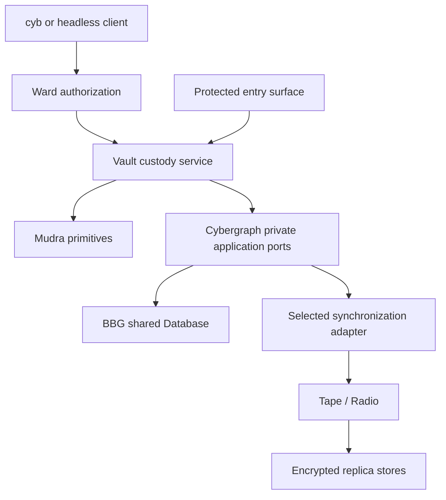

# Architecture

Vault is a reusable custody component with its own repository. Its client
contract is independent of GUI, inference engine and VM. Cyb and headless
applications compose the same service. Native isolation may be a service mode
of the product binary; repository, organ, crate and process are separate units.

## Ownership

| Owner | Responsibility |
|---|---|
| Vault | Secret schemas/lifecycle, protected use, encryption envelopes, replica/recovery policy and validation of restored secrets |
| Soul / Ward | Policy configuration / sole permission authority, including grants and revocations |
| Mudra | Cryptographic primitives, derivation and profile-specific authentication/verification |
| Neuron | Protocol subject/binding references, exact action intents and durable execution through host ports |
| Sigma | Assets, neuron attachments and active subject selection |
| Cybergraph | Canonical application history, schema/admission integration, private storage and sync entry points |
| BBG Database | Shared physical transaction owner, conditional writes, receipts and actual backend durability |
| Foculus / selected sync profile | Shared synchronization mechanics and explicitly selected ordering/fencing or consensus; local Vault commits do not assert finality |
| Tape / Radio | Declared framing / transport, neither supplies custody authority |
| Body / workers | Device placement, process supervision, resource limits and qualified private execution |
| Com / cyb | Protected entry, approval and presentation; ordinary UI/Soma context gets only permitted results |

Arrows describe composition, not a claim that these ports are all implemented.
Vault owns application semantics and retention policy; it MUST reuse stack
storage, history, framing and transport instead of implementing parallel engines.
Soft3 owns their composition contract; this repository owns Vault's details.

## References and scopes

`VaultRef`, `SecretRef`, device IDs, writer epochs and replica locators name
custody data. They create no new neuron or signing subject. One Vault MAY serve
many neurons and compatible networks, with explicit isolation and resource
bounds. A password entry needs no neuron; a watch-only attachment needs no key.

Derivation domain, protocol subject, destination network, endpoint and display
format MUST remain distinct. Supported foreign addresses retain their protocol
representation. Changing a machine, worker or endpoint MUST NOT change a
neuron's key or subject. Spell-derived scope does not authorize its use.

## Trust boundary

The initial native profile isolates plaintext custody from ordinary application,
plugin and agent processes using authenticated bounded IPC and a declared OS
protection profile. Only reviewed operations and cryptographic adapters execute
with secrets. UI/model state, general workers, logs and transport cannot receive
root spells or private keys.

The trusted computing base includes the custody process, relevant OS/hardware,
approved crypto/prover code, protected entry/confirmation and Ward's protected
decision authority. Process isolation supplies no guarantee against an attacker
controlling that process or its OS. Authentication of a compromised ordinary
application's approval does not establish user authorization.

A software key protected by a hardware wrapping key still enters software
memory when used. Hardware-native non-extraction is a separate profile restricted
to the operations that hardware actually supports. Browser/embedded profiles
MUST declare their weaker or different boundary; a web worker alone is not the
native isolation profile. No backend may export a key as an unsupported-operation
fallback.

## Custody, storage and transport adversaries

Replicas and relays may be curious or malicious: inspect ciphertext and metadata,
omit, reorder, replay, equivocate, corrupt or refuse data. Authenticity rejects
modified history; it does not force storage or delivery. Availability requires
retention, independent copies and tested provider-loss recovery. [Recovery](recovery.md)
defines how a restoring client establishes freshness.

The initial privacy claim protects secret values and encrypted semantic metadata
from stores/relays. It does not claim traffic anonymity or hide all record sizes,
timing, device connections or cross-provider ciphertext equality. Profiles MUST
list visible metadata, padding and retention. Public graph publication of a
Vault association, record digest or access pattern requires separate permission.

## Execution and bootstrap

Proved execution follows soft3's five selections: machine, environment, proof,
network and executor. Custody constrains placement and disclosure. A compatible
worker has no automatic right to a private witness; ZK hides it from a verifier,
not from its prover. Only approved relations/output schemas may use a secret.
Local password/OTP use needs no VM, network or proof worker.

Open, unlock and recovery MUST work through an authenticated local private store
before any signing neuron is available. Unlock cannot require a signature from
that same locked spell or a password stored only inside it. Bootstrap permission
belongs to a declared device/recovery ceremony under Ward's authority model.

Stack foundations:
[execution model](https://github.com/cyberia-to/soft3/blob/main/specs/execution-model.md),
[cyb anatomy](https://github.com/cyberia-to/cyb/blob/master/anatomy.md),
[BBG Database](https://github.com/cyberia-to/bbg/blob/master/specs/database.md),
[application storage](https://github.com/cyberia-to/bbg/blob/master/specs/application-storage.md).
